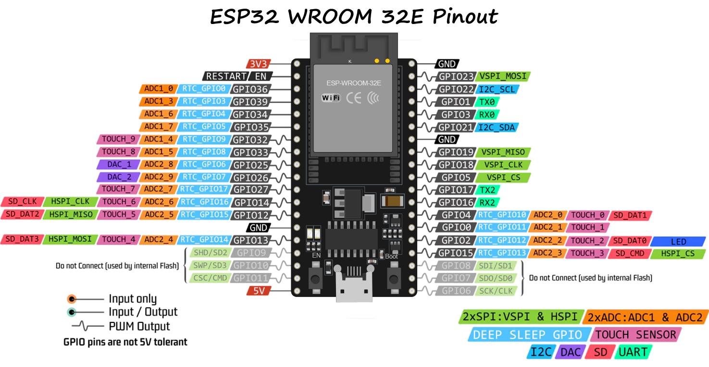
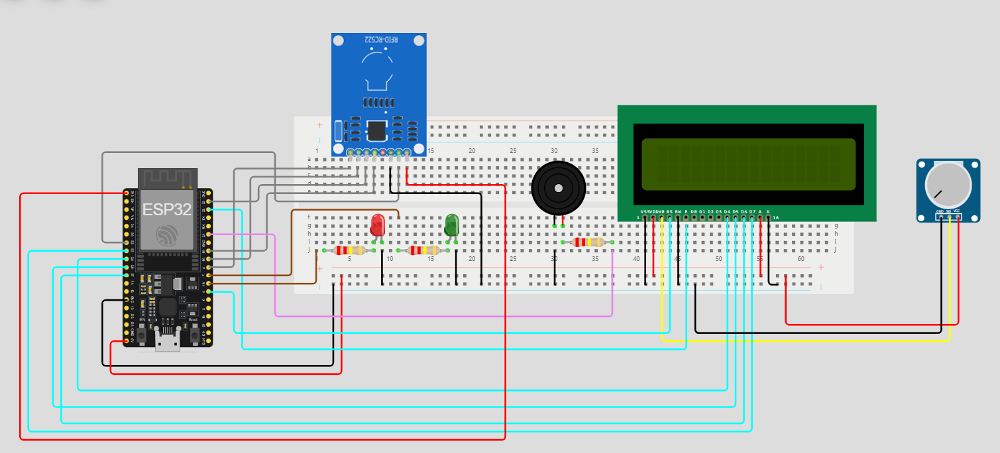

# Blockchain-ESP32

## ESP32
La scheda che è stata usata per la realizzazione di questo progetto è la ESP32-WROOM-32E con la seguente configurazione dei pin

### Installazione ambiente e librerie
- Installare Arduino IDE
- Scaricare le librerie:
    - MFRC522 (by Github Developer v.1.4.11)
    - LiquidCrystal (by Arduino Adafruit v.1.0.7)
    - ArduinoJson (by Benoit Blanchon v.7.2.1)

### Modifica della libreria MFRC522
Per poter usare la libreria MFRC522 con la ESP32 bisogna modificare il file MFRC522Extended.cpp situato nel percorso file Documents\Arduino\libraries\MFRC522\src\MFRC522Extendend.cpp. Bisogna cambiare due righe: 824 e 847.
- rimpiazzare: if (backData && (backlen>0))
- con: if (backData && backlen != nullptr)

### Configurazione dei Pin

|Componente|Pin ESP32|Descrizione|
|:--------:|:-------:|:---------:|
|LED1|GPIO 16|Led Verde|
|LED2|GPIO 17|Led Rosso|
|Buzzer|GPIO 21|Buzzer|

Per l'RFID
|Componente|Pin ESP32|Descrizione|
|:--------:|:-------:|:---------:|
|SS (SDA)|GPIO 5|Chip Select (SS)|
|SCK|GPIO 18|Clock (SCK)|
|MOSI|GPIO 23|MOSI (Master Out Slave In)|
|MISO|GPIO 19|MISO (Master In Slave Out)|
|RST|GPIO 32|Reset|

Per il display LCD (senza modulo I2C)
|Componente|Pin ESP32|Descrizione|
|:--------:|:-------:|:---------:|
|RS|GPIO 4|Register Select (RS)|
|E|GPIO 22|Enable (E)|
|D4|GPIO 25|Dati 4 (D4)|
|D5|GPIO 26|Dati 5 (D5)|
|D6|GPIO 27|Dati 6 (D6)|
|D7|GPIO 33|Dati 7 (D7)|